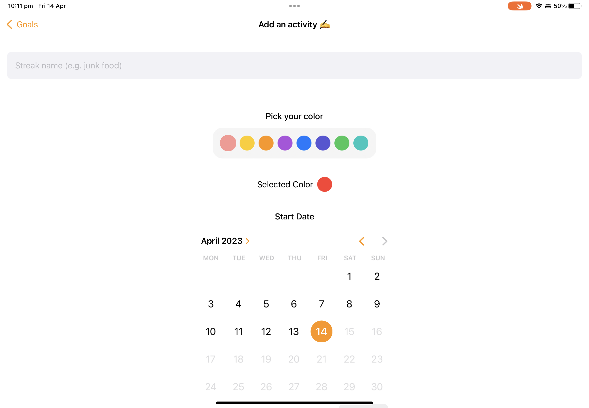

# infinity-app
📅 A day counter app that is simple and elegant. 

## What does it do?

Infinity is designed to be streak/goal tracker and help the user keep track of how long they have progressed. 

It is designed to be easy to use and stay out of the way.

## Features

- Clean and simple goal tracker
- No ads
- No tracking
- All data is stored locally (100% open source)
- Motivational and inspirational notifications
- Reminders to never give up (custom notifications)

## screenshots

### iPhone

Note: These are outdated for iPhone, this will change in final release when published to Test Flight/App Store.

  

### iPad

 
 

